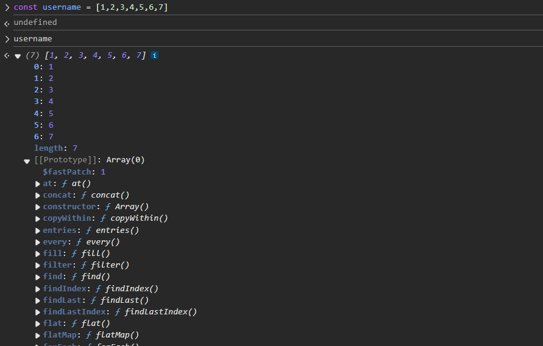
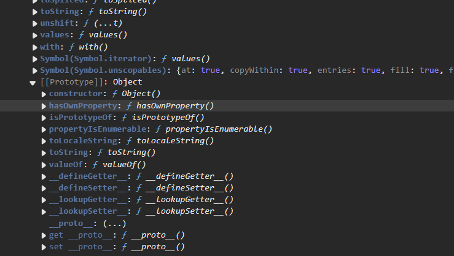
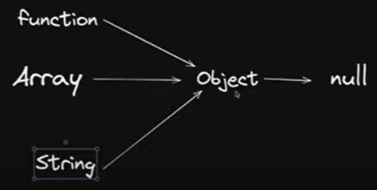

# JavaScript mein Prototype

## 00:02 JavaScript mein Prototype
JavaScript mein Prototype ek unique aur interesting concept hai jo objects ko doosre objects se properties aur methods inherit karne ki suvidha deta hai.

- As you can see above the Prototype is responsible for accessing method.

## 01:50 JavaScript mein prototype behavior samajhna
Har JavaScript object ka ek prototype hota hai. Ek prototype bhi ek object hota hai. Sabhi JavaScript objects apne prototype se properties aur methods inherit karte hain.

## 05:28 JavaScript mein prototype inheritance samajhna
Prototype inheritance ek object ko doosre object ki properties aur methods use karne ki suvidha deta hai. Yeh ek object ke prototype ko doosre object se link karke kiya jata hai.
- 'this' = JISHNE BHI BULAYA USHI KE PASH 
```javascript
function Person(name) {
    this.name = name;
}

Person.prototype.greet = function() {
    console.log(`Hello, my name is ${this.name}`);
    // THIS = JISHNE BHI BULAYA USHI KE PASH 
};

const person1 = new Person('Alice');
person1.greet(); // Hello, my name is Alice
```

## 07:19 JavaScript mein objects aur prototypes samajhna
JavaScript mein objects ke paas properties aur methods ho sakte hain. Yeh properties aur methods object ke prototype se inherit kiye ja sakte hain.

## 11:05 JavaScript mein functions aur objects properties aur behavior share karte hain
JavaScript mein functions bhi objects hote hain. Inke paas bhi properties aur methods hote hain jaise kisi aur object ke hote hain.

## 12:56 JavaScript prototypes mein 'this' ka use samajhna
JavaScript mein `this` keyword us object ko refer karta hai jo current function ko execute kar raha hai. Prototypes mein, `this` us object ko refer karta hai jisne method ko call kiya hai.

```javascript
function Car(model) {
    this.model = model;
}

Car.prototype.showModel = function() {
    console.log(`This car is a ${this.model}`);
};

const car1 = new Car('Toyota');
car1.showModel(); // This car is a Toyota
```

## 16:46 JavaScript mein prototype ka use karke object properties ko efficiently manage karna
Prototypes ka use karke object properties ko efficiently manage kiya ja sakta hai by sharing methods aur properties across instances.

## 18:29 JavaScript mein prototype aur method creation samajhna
Methods ko ek object ke prototype mein add kiya ja sakta hai, jo us object ke sabhi instances ko same method share karne ki suvidha deta hai.

```javascript
function Animal(type) {
    this.type = type;
}

Animal.prototype.speak = function() {
    console.log(`${this.type} makes a sound`);
};

const animal1 = new Animal('Dog');
animal1.speak(); // Dog makes a sound
```
### <span style="color:green">You don't have to write Prototype keyword always (see line chai.printme()).</span>

```javascript
function createUser(username, score){
    this.username = username
    this.score = score
}

createUser.prototype.increment = function(){
    this.score++
}
createUser.prototype.printMe = function(){
    console.log(`price is ${this.score}`);
}

const chai = new createUser("chai", 25)
const tea = createUser("tea", 250)

chai.printMe() // chai.prototype.printme(), this is very inefficient code as prototype inheritance.
```
## 22:03 JavaScript mein 'new' keyword ki functionality samajhna
JavaScript mein `new` keyword ek naya object create karta hai aur uske prototype ko constructor function ke prototype par set karta hai.

## 23:38 New keyword se linked objects create karna with prototype properties
Jab ek object `new` keyword ka use karke create kiya jata hai, to yeh constructor function ke prototype se linked hota hai.

## 26:54 JavaScript mein prototypes ka concept samajhna
Prototypes ko samajhna zaroori hai kyunki yeh JavaScript mein inheritance kaise kaam karta hai yeh batata hai.
- <span style="color:green">FUNCTION, ARRAY AND STRINGS ALL PASS THROUGH **OBJECT**.THUS, method(functions) available to use for object will also be accessible by other function, array and string too.</span>

```javascript
// let myName = "hitesh     "
// let mychannel = "chai     "

// console.log(myName.trueLength);


let myHeros = ["thor", "spiderman"]


let heroPower = {
    thor: "hammer",
    spiderman: "sling",

    getSpiderPower: function(){
        console.log(`Spidy power is ${this.spiderman}`);
    }
}

Object.prototype.hitesh = function(){
    console.log(`hitesh is present in all objects`);
}

Array.prototype.heyHitesh = function(){
    console.log(`Hitesh says hello`);
}

// heroPower.hitesh()
// myHeros.hitesh()
// myHeros.heyHitesh()
// heroPower.heyHitesh()

// inheritance

const User = {
    name: "chai",
    email: "chai@google.com"
}

const Teacher = {
    makeVideo: true
}

const TeachingSupport = {
    isAvailable: false
}

const TASupport = {
    makeAssignment: 'JS assignment',
    fullTime: true,
    __proto__: TeachingSupport
}

Teacher.__proto__ = User

// modern syntax
Object.setPrototypeOf(TeachingSupport, Teacher)

let anotherUsername = "ChaiAurCode     "

String.prototype.trueLength = function(){
    console.log(`${this}`);
    console.log(`True length is: ${this.trim().length}`);
}

anotherUsername.trueLength()
"hitesh".trueLength()
"iceTea".trueLength()
```

## 28:37 JavaScript mein true string length property implement karna
Aap built-in objects jaise String ke prototype mein properties add kar sakte hain.

```javascript
String.prototype.trueLength = function() {
    return this.replace(/\s+/g, '').length;
};

const str = "Hello World";
console.log(str.trueLength()); // 10
```

## 32:25 Prototype ka use karke properties aur methods ko objects mein add aur access karna
Prototypes ka use karke aap properties aur methods ko objects mein efficiently add aur access kar sakte hain.

## 34:27 JavaScript mein prototype objects ki power aur properties samajhna
Prototype objects powerful hote hain kyunki yeh instances ke across shared properties aur methods ki suvidha dete hain.

## 38:08 JavaScript development mein teaching support aur object properties
Prototypes ko samajhna JavaScript development ko sikhane aur support karne ke liye crucial hai.

## 39:53 Prototypes ka use karke properties ko access karna
Properties ko prototype chain ka use karke access kiya ja sakta hai.

## 43:18 JavaScript mein properties ko directly access aur manipulate karna
Properties ko directly object par ya uske prototype ke through access aur manipulate kiya ja sakta hai.

## 45:01 JavaScript prototypes mein true length property ko access aur use karna
True length property ko access aur use karke string ki length bina spaces ke paayi ja sakti hai.

```javascript
const exampleString = "Hello Prototype";
console.log(exampleString.trueLength()); // 14
```